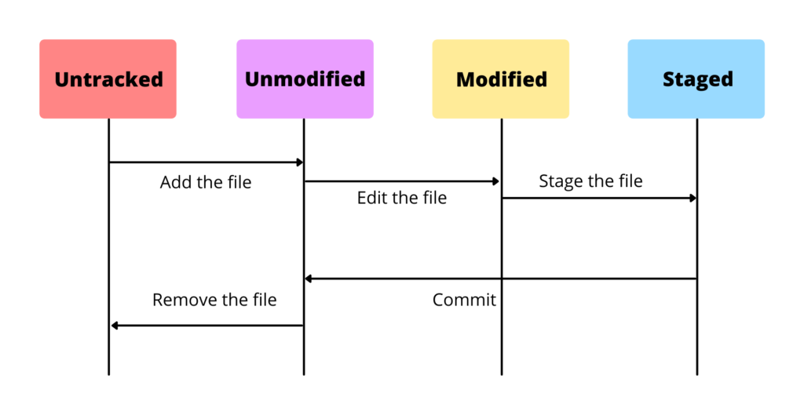

# Git

## Git - Definition

- Git은 분산버전관리시스템으로 코드의 버전을 관리하는 도구
- 1. 작업을 하고 
  2. 변경된 파일을 모아 (add)
  3. 버전으로 남긴다 (Commit)
- Git은 파일을 modified, staged, committed 로 관리
  - Modified: 파일이 수정된 상태 (add 명령어를 통하여 staging area 로)
  - Staged: 수정한 파일을 곧 커밋할 것이라고 표시한 상태 (commit 명령어로 저장소)
  - committed: 커밋이 된 상태

## Git - File Lifecycle

- Status로 확인할 수 있는 파일의 상태
  - Tracked : 이전부터 버전으로 관리되고 있는 파일
    - Unmodified : git status 에 나타나지 않음
    - Modified : Changes not staged for commit
    - Staged : Changes to be committed
  - Untracked : 버전으로 관리된 적 없는 파일 (파일을 새로 만든 경우)
- 

## Git - Command Line

