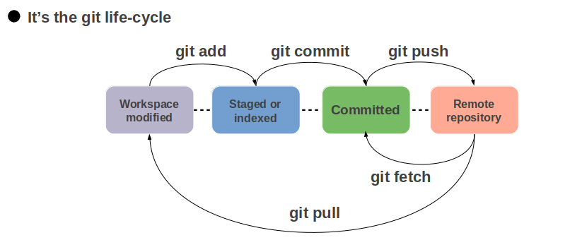

# Git

## Git - Definition

- Git은 분산버전관리시스템으로 코드의 버전을 관리하는 도구
- 1. 작업을 하고 
  2. 변경된 파일을 모아 (add)
  3. 버전으로 남긴다 (Commit)
- Git은 파일을 modified, staged, committed 로 관리
  - Modified: 파일이 수정된 상태 (add 명령어를 통하여 staging area 로)
  - Staged: 수정한 파일을 곧 커밋할 것이라고 표시한 상태 (commit 명령어로 저장소)
  - committed: 커밋이 된 상태

## Git - File Lifecycle

- Status로 확인할 수 있는 파일의 상태
  - Tracked : 이전부터 버전으로 관리되고 있는 파일
    - Unmodified : git status 에 나타나지 않음
    - Modified : Changes not staged for commit
    - Staged : Changes to be committed
  - Untracked : 버전으로 관리된 적 없는 파일 (파일을 새로 만든 경우)

## Git - Command Line

- `pwd` : 현재 디렉토리 출력

- `cd 디렉토리이름` : 디렉토리 이동

- `cd 디렉토리이름 .` : 현재 디렉토리

- `cd 디렉토리이름..` : 상위 디렉토리로 이동

- `ls` : 목록 (list) 

- `mkdir` : 디렉토리 생성 (make directory, a.k.a. make folder)

- `touch` : 파일 생성

- `rm 파일명` : 파일 삭제하기

- `rm –r 폴더명` : 폴더 삭제하기

- `git init` : 저장소 처음 만들때 (로컬 저장소 생성)

- `git add .` : 특정 파일/폴더의 변경사항 추가

- `git commit -m '커밋메시지'` : 버전을 기록할 때

- `git status` : 상태확인 (1통, 2통)

- `git log` : 커밋 (버전) 확인

- `rm -rf .git` : git init (master) 를 삭제

- `git branch 브랜치 이름` : 브랜치 생성

- `git checkout 브랜치 이름` : `브랜치이름` 의 브랜치로 전환

- `git checkout -b 브랜치 이름` : 브랜치를 생성하며 바로 그 브랜치로 전환

- `ctrl+c` : 최근 진행중인 명령 취소

  